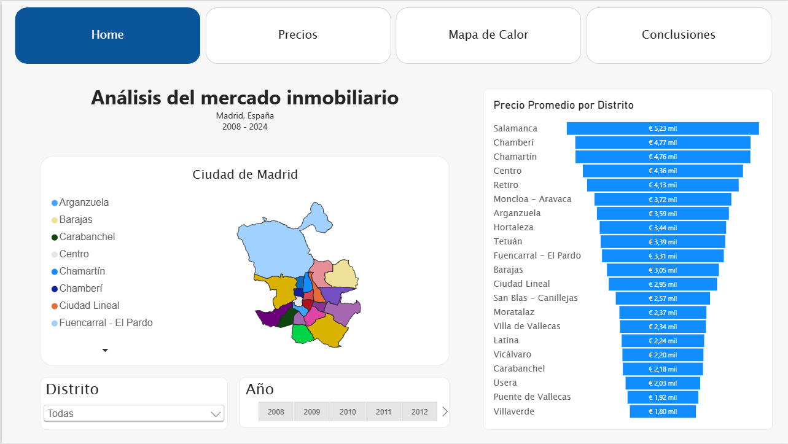
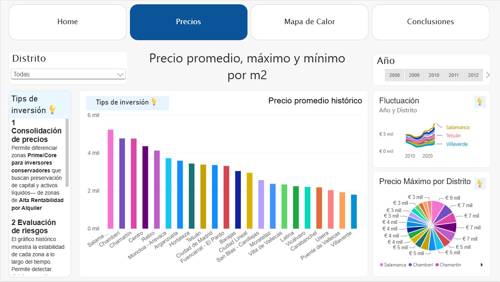
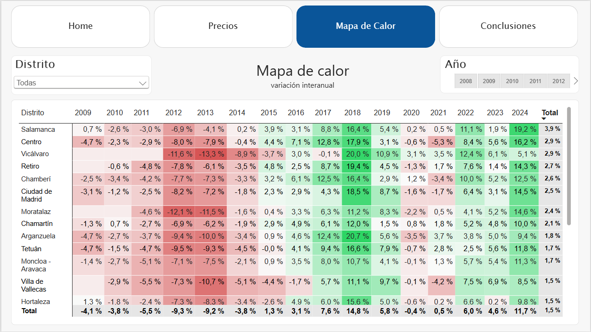
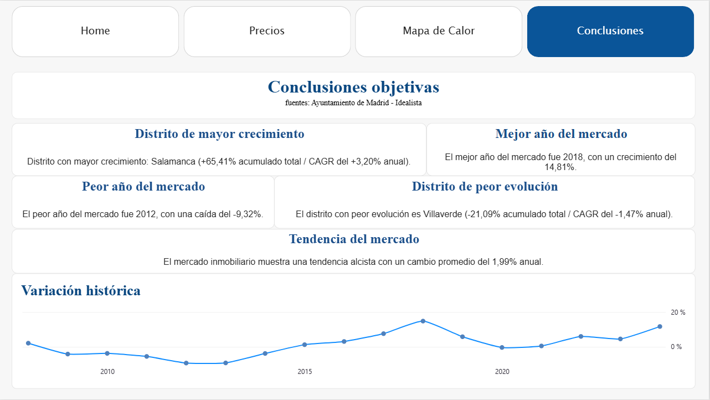

# Análisis del Mercado Inmobiliario – Madrid (2007–2024)

Análisis del mercado inmobiliario de Madrid utilizando Google Sheets y Power BI, incluyendo limpieza de datos, modelado, visualización avanzada y generación de insights orientados al negocio.

## Objetivo del Proyecto

Comprender la evolución del precio por metro cuadrado (m²) en los distritos de Madrid entre 2007 y 2024, identificando:

## Variación anual del mercado
- Distritos con mayor y menor crecimiento
- Patrones de comportamiento por zona
- Tendencias útiles para compradores, inversores y analistas
- Vista Previa del Dashboard

## Previsualización

🟦 Página 1 — Ranking de precios por distrito

  

🟦 Página 2 — Precios

  

🟦 Página 3 — Mapa de calor

  

🟦 Página 4 — Conclusiones

  

## Principales Insights
El distrito con mayor crecimiento acumulado es Salamanca (+3,43%).
El distrito con menor desempeño es Villaverde (-1,0%).
El mejor año del mercado fue 2018 (+14,81%).
El peor año fue 2012 (-9,32%).
La tendencia general del mercado es ascendente, con un crecimiento anual medio del 1,99%.

## Proceso de Análisis
### 1. Recopilación del Dataset (CSV)

Datos oficiales del Ayuntamiento de Madrid:

https://servpub.madrid.es/CSEBD_WBINTER/seleccionSerie.html?numSerie=0504030000152

### 2. Limpieza y Transformación en Google Sheets y Power Query
Normalización de columnas
Corrección de valores atípicos
Estandarización de distritos y fechas
Eliminación de inconsistencias

### 3. Modelado en Power BI
Creación de relaciones entre tablas
Creación de medidas DAX
Segmentación por distrito y año
Cálculo de variación interanual (YoY) y variación acumulada

### 4. Visualización
Ranking de precios por distrito
Mapa de calor de la evolución anual
Insights automáticos generados mediante DAX
Diseño visual orientado a consultoría

### Estructura del Repositorio
Real-Estate-Madrid-Analysis/

/Images
  Recursos visuales del proceso:
  - Conclusiones y tendencia.png
  - Heatmap.png
  - Modelo de estrella.png
  - Plantilla de precios de Madrid en bruto.png
  - Ranking por distritos.png
  - Tabla transformada.png
  - Tablas.png

/dataset
  Archivos utilizados:
  - Datos inmobiliarios - Visualizacion.pdf
  - Datos inmobiliarios.pbix
  - Precios historicos Madrid - Ayuntamiento.xlsx

README.md
📎 Archivos Incluidos
Datos inmobiliarios.pbix → Dashboard final
Datos inmobiliarios - Visualizacion.pdf → Informe exportado
dataset/ → Datos originales
Images/ → Capturas del dashboard

### Aprendizajes
Diseño de dashboards con un enfoque orientado a consultoría
Creación de medidas DAX para análisis dinámicos
Limpieza y normalización de datos reales
Documentación clara del proceso analítico

### Conclusiones
¿Por qué están aumentando los precios?

El análisis sugiere que el incremento de los precios de la vivienda en Madrid a largo plazo está relacionado principalmente con la interacción entre una demanda creciente y una oferta de vivienda relativamente limitada. Sin embargo, los precios también están condicionados por factores económicos y financieros más amplios que afectan a la capacidad de compra de los hogares, el acceso al crédito y las decisiones de inversión.

Diversos factores estructurales y macroeconómicos pueden ayudar a explicar la evolución del mercado:

### Crecimiento de la demanda: Madrid continúa atrayendo población, empleo y actividad económica, aumentando la demanda de vivienda.
Oferta de vivienda limitada: La construcción de nuevas viviendas no siempre ha evolucionado al mismo ritmo que la demanda, generando una presión persistente al alza sobre los precios.
Disponibilidad limitada de suelo: La disponibilidad y el desarrollo de suelo adecuado limitan la capacidad de incrementar rápidamente la oferta de vivienda, especialmente en zonas con una demanda elevada.
Descenso de los tipos de interés: La reducción de los tipos de interés europeos ha mejorado las condiciones de financiación respecto al entorno de tipos elevados de 2023–2024. El tipo de interés de las operaciones principales de financiación del BCE pasó del 4,25% en junio de 2024 al 2,40% en junio de 2026, reduciendo el coste de financiación bancaria y favoreciendo una mejora gradual de las condiciones de financiación.

Mejora de las condiciones económicas: Tras la fuerte contracción de la economía española en 2020, la actividad económica se recuperó con fuerza. El PIB de España creció un 5,5% en 2021 y, tras posteriores revisiones estadísticas, un 6,2% en 2022. Un entorno económico más favorable puede impulsar la demanda de vivienda al mejorar el empleo, las expectativas de ingresos de los hogares y la confianza de los consumidores.

Descenso del desempleo: La tasa de desempleo en España descendió del 15,53% en 2020 al 12,92% en 2022, reflejando una mejora significativa de las condiciones del mercado laboral durante el periodo de recuperación.

Mejora del acceso a la financiación hipotecaria: A medida que mejoran las condiciones de financiación, más hogares pueden recuperar el acceso al crédito hipotecario o estar dispuestos a entrar en el mercado inmobiliario. Esto puede incrementar la demanda efectiva, especialmente cuando se combina con una oferta de vivienda relativamente limitada.

Costes de construcción: El incremento de los costes de construcción y de los materiales puede aumentar el coste final de las viviendas nuevas y reducir la velocidad a la que nueva oferta puede incorporarse al mercado.

Concentración económica: La posición de Madrid como uno de los principales centros económicos y de empleo aumenta su atractivo para trabajadores, empresas e inversores, contribuyendo a mantener una demanda de vivienda sostenida.

Demanda de inversión: La vivienda también puede atraer a inversores que buscan rentabilidades a largo plazo, añadiendo otra fuente de demanda, especialmente en zonas con mercados de alquiler sólidos y expectativas de apreciación del capital.

Estos factores no deben interpretarse como causas individuales derivadas directamente del dataset. El proyecto identifica patrones históricos de precios, mientras que la interpretación económica más amplia está respaldada por investigaciones externas e indicadores macroeconómicos de instituciones como el Banco de España, el BCE y el INE.

Sin embargo, esta proyección debe considerarse un escenario basado en tendencias históricas y no una previsión definitiva de precios. Un modelo de forecasting más robusto requeriría variables adicionales como tipos de interés, crecimiento de la población, ingresos, actividad constructora, concesión de hipotecas y empleo.

Esto representa una oportunidad para continuar desarrollando el análisis y construir modelos predictivos más avanzados.
